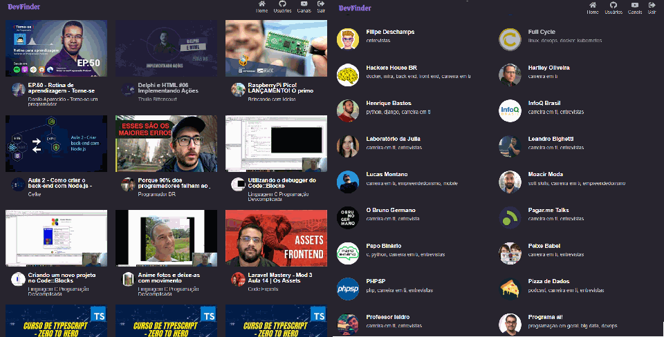

# DevFinder

<div flex-direction="row">
  
    
</div>

<div align="center">
    
</div>

<br />
<strong>Conteúdos sobre Tecnologia, Desenvolvimento e Programação em Português.</strong>

## Conteúdos
.Vídeos
.Usuários github
.Canais

## Demostração

Caso deseje visualizar aplicação antes de instalar, você pode acessar o <a href="https://dev-finder.netlify.app/">link da aplicação</a> que esta hospedada na Netlify.

# Para executar locamente:

#### 1.Pré-requisitos

Antes de começar, você vai precisar ter instalado em sua máquina as seguintes ferramentas:
[Git](https://git-scm.com), [Node.js](https://nodejs.org/en/). 
Além disto é bom ter um editor para trabalhar com o código como [VSCode](https://code.visualstudio.com/)

#### 2.Instalação

Para a instalação do projeto, primeiramente baixe o <a href="https://nodejs.org/en/">Node.js</a>.

Após a instalação do Node, você deve clonar o repositório:
```bash
git clone https://github.com/MarceloVilela/devfinder-next.git
```
Após a clonagem, execute o comando abaixo dentro da pasta do projeto para baixar todas as dependências:
```bash
pnpm install
```

#### 3.Variáveis ambiente
Crie um arquivo .env, 
copie o conteúdo do arquivo .env.example e cole dentro de .env,
altere caso necessário.

#### 4.Como utilizar

Após clonar, execute o comando abaixo:

```bash
pnpm dev
```

Abra [http://localhost:3000](http://localhost:3000) em seu navegador para utilizar a aplicação.

## Arquitetura de renderização

App Router. SSR/ISR em **todas** as rotas de dado público — listagem (`/`, `/video`, `/user`,
`/channel`, revalidação de 8h) e detalhe (`/user/:slug`, `/video/:slug`, `/channel/:slug`,
renderizado por request, sem `generateStaticParams` porque o conjunto de slugs é aberto). A
interatividade (like/dislike, paginação além da página 1) fica isolada em Client Components na
folha da árvore. A única exceção é o que depende da sessão do usuário logado (favoritos,
inscrições) — a sessão vive em `localStorage`, inacessível a um Server Component sem cookie
`httpOnly`, então essas telas continuam CSR.